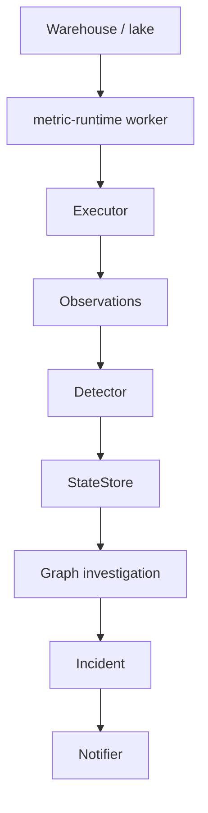

# Architecture

metric-runtime turns business metrics into executable semantic objects.

```
Metric semantics
      ↓
Observation
      ↓
Detection
      ↓
State transition
      ↓
Dependency traversal
      ↓
Incident
      ↓
Action
```

## 1. Semantic model

A `KPI` describes **what a metric means**: formula intent, dependencies,
dimensions, ownership, directionality, detector policy, and support rules.

KPI definitions do **not** contain database credentials or infrastructure details.

## 2. Metric execution

A `MetricExecutor` calculates observations from a resource.

`DuckDBExecutor` is the v0.1 analytical backend. Future backends (Snowflake,
BigQuery, …) should plug in without changing KPI semantics.

## 3. Observations

A `KPIObservation` is a measured value at a time and scope.

Observation ≠ Detection ≠ State ≠ Incident.

## 4. Detection

A `Detector` answers: is this unusual?

The seasonal z-score is **one** detector implementation, not the architecture.
Ship your own detector without modifying `KPIEngine`.

## 5. State machine

States: `NORMAL` → `DETECTED` → `OPEN` → `ACKNOWLEDGED` → `RESOLVED`
(plus `SUPPRESSED`).

**An anomaly is not an alert.** Persistence, support, impact, and quality gates
decide whether the organization should care yet.

## 6. Semantic dependency graph

NetworkX models **business** relationships, not technical lineage.

Supports validation, cycle detection, ancestors/descendants, explanatory paths,
and deepest anomalous candidates.

## 7. Investigation

`engine.investigate(...)` returns structured `InvestigationResult` objects:
anomalous metrics, explanatory paths, and root candidates.

Graph traversal does **not** prove causality. Prefer “root candidate” and
“deepest anomalous dependency”.

## 8. Incidents

An `Incident` captures primary metric, explanatory KPI, scope, owner, state,
impact, and evidence. Creation is separate from notification.

## 9. Ownership / routing

Route to the team best positioned to act — usually the owner of the deepest
useful explanatory KPI, not the owner of the top-level red number.

## 10. Notification adapters

`Notifier.notify(incident, *, idempotency_key=...)` is an extension point.
Core does not depend on Slack/Teams SDKs.

## 11. State persistence

`StateStore` remembers what metric-runtime already observed/concluded.

`InMemoryStateStore` ships for zero-infra use. Production would typically use
a persistent store (e.g. Postgres) — not shipped in v0.1.

Warehouse/lake = historical business facts.
StateStore = operational conclusions.

## Evaluation identity

One runtime evaluation is identified by:

`(metric, scope, evaluation window)`

encoded as an `EvaluationKey`. The same key means the same logical tick —
retries and concurrent workers must not invent a second committed result.

## Atomic runtime commit

For one `EvaluationKey`, the atomic unit is:

- observation
- metric state record
- incident mutation (if any)
- outbox event(s) (if any)
- committed `EvaluationRecord`

Either all become visible, or none do. `KPIEngine.process()` stages these
inside `store.transaction()` and commits once.

## Idempotency

If an `EvaluationKey` is already committed, `process()` returns the stored
`EvaluationRecord` / `ProcessResult` and does **not** re-run the executor,
detector, state machine, or outbox creation.

## Concurrency

Only one worker may own an `EvaluationKey` for transition processing
(`claim_evaluation`). Concurrent callers receive either the committed result
or `EvaluationInProgressError`.

## Transactional outbox

The state transaction persists notification **intent** only
(`OutboxEvent` with a stable `event_key`). External delivery runs afterward via
`deliver_notifications()`.

## Delivery guarantees

| Layer | Guarantee |
|---|---|
| Runtime transition | Idempotent — single committed result per `EvaluationKey` |
| Outbox intent | Deduplicated per meaningful transition (`event_key`) |
| External notifier | At-least-once unless the notifier honors `idempotency_key` |

## Quality and persistence streaks

Ineligible (quality-failed) windows are visible to state evolution. They
**break** consecutive detection streaks; they do not bridge anomalies across a
gap.

## Timezone policy

Core timestamps must be timezone-aware. Naive datetimes are rejected.

## 12. Execution backends



The worker can be a disposable container job. Persistent state lives outside it.
