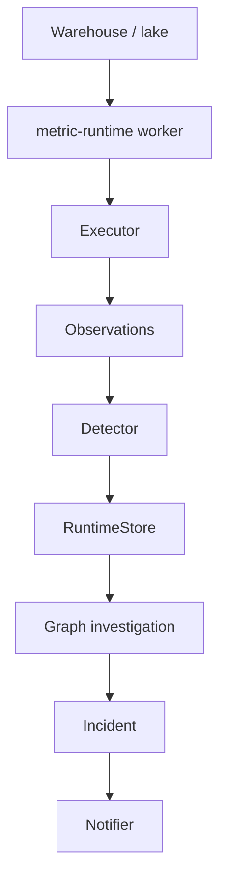

# Architecture

Metric Runtime is a Python-native framework for **defining, validating,
executing and operationalizing** semantic business metrics.

```
                   Metric Repository
                         │
                         ▼
                   MetricCatalog
             ┌───────────┴───────────┐
             │                       │
             ▼                       ▼
        Introspection             Runtime
        JSON/schema               Execution
        Docs/diffs                Detection
                                  State
                                  Investigation
```

Product composition (outside core):

```
             Metric
               │
               ▼
        Product wrapper
    draft/publish/layout/auth
```

Core owns the semantic contract. Products wrap it — they do not redefine
calculation, dependencies, unit, detector, or owner.

```
MetricCatalog
│
├── Metric semantics (id, owner, deps, detector, …)
│
└── Calculation specs
        │
        ▼
EvaluationSession / planner
│
├── Formula
├── SQL
├── Batch (shared)
└── Derived
        │
        ▼
Executor(s)
        │
        ▼
KPIObservation  (identity = Metric.id)
        │
        ▼
Runtime lifecycle
│
├── Detector
├── Ordered metric/scope state
├── Graph investigation
├── Incident
└── Outbox
```

## Layer ownership

| Layer | Owns |
|---|---|
| Metric Runtime | semantic contract, calculation contracts, evaluation orchestration, observation creation, state lifecycle |
| Executor | connection-specific mechanics (DuckDB SQL binding, fact-table aggregates) |
| Application | domain SQL, batch registrations, catalog definitions |

## Business graph vs execution graph

**Semantic / business graph** (`KPI.dependencies`): explanatory relationships for
investigation and ownership routing.

**Execution grouping** (batch sources): shared computation for efficiency.

These are different graphs. Do not merge them.

See also [calculations.md](calculations.md) and
[ADR 0001](adr/0001-first-class-calculations.md).

## 1. Semantic model

A `KPI` describes **what a metric means**: calculation, dependencies,
dimensions, ownership, directionality, detector policy, and support rules.

KPI definitions do **not** contain database credentials or infrastructure details.

## 2. Metric execution

A `MetricExecutor` calculates formula observations from a resource.
SQL/batch calculations use the executor's scalar/row SQL interface when present.

`DuckDBExecutor` and `PostgresExecutor` are the analytical backends. Both can
run SQL/batch-only sessions without a designated `fact_table`; formula/measure
aggregation still requires one. `PostgresExecutor` uses read-only sessions with
a statement timeout. An executor advertises the SQL dialects it accepts
(`sql_dialects`); the evaluation session rejects calculations in any other
dialect. Future backends (Snowflake, BigQuery, …) should plug in without
changing KPI semantics. Metric Runtime does **not** transpile SQL across dialects.

## 3. Observations

A `KPIObservation` is a measured value at a time and scope.

Observation ≠ Detection ≠ State ≠ Incident.

## 4. Detection

A `Detector` answers: is this unusual?

The seasonal z-score is **one** detector implementation, not the architecture.
Ship your own detector without modifying `KPIEngine`.

## 5. State machine

States: `NORMAL` → `DETECTED` → `OPEN` → `ACKNOWLEDGED` → `RESOLVED`
(plus `SUPPRESSED`).

**An anomaly is not an alert.** Persistence, support, impact, and quality gates
decide whether the organization should care yet.

## 6. Semantic dependency graph

NetworkX models **business** relationships, not technical lineage.

Supports validation, cycle detection, ancestors/descendants, explanatory paths,
and deepest anomalous candidates.

## 7. Investigation

`engine.investigate(...)` returns structured `InvestigationResult` objects:
anomalous metrics, explanatory paths, and root candidates.

Graph traversal does **not** prove causality. Prefer “root candidate” and
“deepest anomalous dependency”.

## 8. Incidents

An `Incident` captures primary metric, explanatory KPI, scope, owner, state,
impact, and evidence. Creation is separate from notification.

## 9. Ownership / routing

Route to the team best positioned to act — usually the owner of the deepest
useful explanatory KPI, not the owner of the top-level red number.

## 10. Notification adapters

`Notifier.notify(incident, *, idempotency_key=...)` is an extension point.
Notifiers that implement `EventNotifier.notify_event(event)` receive the full
outbox event instead (including its stable `event_key`). The built-in
`WebhookNotifier` posts signed JSON using only the standard library.
Core does not depend on Slack/Teams SDKs.

## 11. Runtime persistence

A `RuntimeStore` (formerly `StateStore`, still available as an alias) remembers
what metric-runtime already observed and concluded: observations, metric
state, committed evaluations, evaluation claims, incidents and the
notification outbox.

- `InMemoryRuntimeStore` (alias `InMemoryStateStore`) — zero-infra, per process.
- `PostgresRuntimeStore` — durable, multi-worker safe; tables live in a
  dedicated schema created by numbered migrations
  (`metric-runtime store migrate`). Install with
  `pip install "metric-runtime[postgres]"`.

Warehouse/lake = historical business facts.
RuntimeStore = operational conclusions. It is never the analytical source.

## Orchestration layering

```
CLI: metric-runtime run --once / run
        │
        ▼
MetricRuntime   (what is due, per-tick sessions, outbox drain, run loop)
        │
        ▼
KPIEngine.process   (one evaluation, authoritative lifecycle)
        │
        ▼
RuntimeStore / MetricExecutor / Notifier
```

`KPIEngine` has no scheduling loop. `MetricRuntime` decides which windows are
due from each metric's **evaluation cursor** — the `effective_at` of its
latest committed evaluation — and calls `process()` per window.

## NO_DATA vs execution errors

- A window whose calculation yields **NO_DATA** (no rows, NULL, divide by
  zero, or no usable baseline) is a valid outcome. It is committed as an
  observation + evaluation, the metric state is carried forward unchanged
  (no incidents, no outbox), and the cursor advances so it is never re-run.
  NO_DATA observations are ignored by state streaks: a data gap neither
  breaks nor extends a detection/healthy streak, and an OPEN incident stays
  OPEN across it.
- An **execution error** (SQL error, connectivity, `ERROR` result) commits
  nothing. The window stays due and is retried until it falls outside
  `runtime.max_catchup_windows`.

## Evaluation identity

One runtime evaluation is identified by:

`(metric, scope, evaluation window)`

encoded as an `EvaluationKey`. The same key means the same logical tick —
retries and concurrent workers must not invent a second committed result.

**Time semantics**

- **effective_at** — business time of the evaluation window (`EvaluationKey.eval_at`,
  also `ProcessResult.at`)
- **processed_at** — wall-clock commit time (`EvaluationRecord.committed_at`,
  `MetricStateRecord.updated_at`)

Metric-state application for one `(metric, scope)` stream is **monotonic in
effective_at**. A later window waits for earlier in-flight windows; an older
window arriving after a newer commit raises `StaleEvaluationError`.

Different metrics or scopes proceed concurrently (separate streams).

## Atomic runtime commit

For one `EvaluationKey`, the atomic unit is:

- observation
- metric state record
- incident mutation (if any)
- outbox event(s) (if any)
- committed `EvaluationRecord`

Either all become visible, or none do. `KPIEngine.process()` stages these
inside `store.transaction()` and commits once.

## Idempotency

If an `EvaluationKey` is already committed, `process()` returns the stored
`EvaluationRecord` / `ProcessResult` and does **not** re-run the executor,
detector, state machine, or outbox creation.

## Concurrency

Only one worker may own an `EvaluationKey` for transition processing
(`claim_evaluation`). Concurrent callers receive either the committed result
or `EvaluationInProgressError`.

In Postgres, claims are leased rows (`expires_at`, from `claim_ttl`), so a
crashed worker's claim can be taken over. Waiting for earlier windows of a
stream holds no lock. The commit itself takes a transaction-scoped advisory
lock per `(metric, scope)` (`pg_advisory_xact_lock`), re-checks the claim,
duplicates, staleness and earlier in-flight claims while holding it, and
guards the metric-state upsert with the expected version. A conflict found
at commit (`StreamCommitConflict`) makes `process()` re-run the ordered
section (re-read state, recompute) up to 3 times; the calculated observation
is reused.

## Transactional outbox

The state transaction persists notification **intent** only
(`OutboxEvent` with a stable `event_key`). External delivery runs afterward
(`MetricRuntime.run_once()` drains the outbox every cycle;
`KPIEngine.deliver_notifications()` is the same logic for library use).

Delivery is leased: a worker claims due events (`claim_token`,
`claimed_until`), sends them, then marks them delivered or records a failed
attempt with exponential backoff. After `max_attempts` an event is
dead-lettered. Writes from a worker whose lease expired are rejected, and an
expired lease makes the event claimable again.

## Delivery guarantees

| Layer | Guarantee |
|---|---|
| Runtime transition | Idempotent — single committed result per `EvaluationKey` |
| Outbox intent | Deduplicated per meaningful transition (`event_key`) |
| External notifier | At-least-once unless the notifier honors `idempotency_key` |

## Quality and persistence streaks

Ineligible (quality-failed) windows are visible to state evolution. They
**break** consecutive detection streaks; they do not bridge anomalies across a
gap. NO_DATA windows are different: they are skipped by streak evaluation (see
above).

## Timezone policy

Core timestamps must be timezone-aware. Naive datetimes are rejected.

## 12. Execution backends


```mermaid
flowchart TD
  WH[Warehouse / lake] --> W[metric-runtime worker]
  W --> E[Executor]
  E --> O[Observations]
  O --> D[Detector]
  D --> S[RuntimeStore]
  S --> G[Graph investigation]
  G --> I[Incident]
  I --> N[Notifier]
```

The worker can be a disposable container job (`run --once`) or a long-running
process (`run`). Persistent state lives outside it, in the runtime store.
